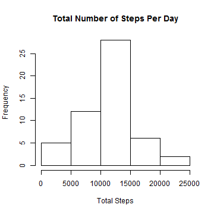
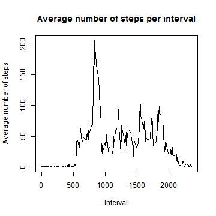
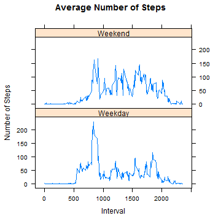

# Reproducible Research: Peer Assessment 1


## Loading and preprocessing the data


```r
##### Unzip the file if it doesn't already exist
if (!file.exists("activity.csv")) {
    unzip("activity.zip")
}

##### Load the data
colClasses <- c("numeric", "Date", "numeric")
data <- read.csv("activity.csv", colClasses = colClasses)
```


## What is the mean total number of steps taken per day?
The missing `NA` cases are removed and the number of steps per day are calculated.


```r
##### Remove missing values
activity <- data[complete.cases(data), ]

##### Calculate the total number of steps per day
total_steps_per_day <- with(activity, aggregate(steps, by = list(date), sum))
colnames(total_steps_per_day) <- c("Date", "Total.Steps")
```


### Histogram of total number of steps per day

```r
hist(total_steps_per_day$Total.Steps, main = "Total Number of Steps Per Day", 
    xlab = "Total Steps")
```

 


### Mean and Median of the total number of steps per day

```r
ave_steps_per_day <- mean(total_steps_per_day$Total.Steps)
median_steps_per_day <- median(total_steps_per_day$Total.Steps)
```

The `mean` is 1.0766 &times; 10<sup>4</sup> and the `median` is 1.0765 &times; 10<sup>4</sup>.

## What is the average daily activity pattern?
The average number of steps per 5-minute interval, averaged across all days is calculated as follows:


```r
ave_steps_per_interval <- with(activity, aggregate(steps, list(interval), mean))
colnames(ave_steps_per_interval) <- c("Interval", "Average.Steps")
```


### Time series of the average number of steps taken

```r
with(ave_steps_per_interval, plot(x = Interval, y = Average.Steps, type = "l", 
    main = "Average number of steps per interval", ylab = "Average number of steps"))
```

 


### Time with the maximum number of steps

```r
max_step_index <- which.max(ave_steps_per_interval$Average.Steps)
max_time <- ave_steps_per_interval$Interval[max_step_index]
```

The interval with highest average number of steps is 835.

## Imputing missing values

### Number of missing values

```r
##### Number of missing values
missing <- which(is.na(data$steps))
num_missing <- length(missing)
```

Number of missing values is 2304.

Preliminary analysis shows that the missing data tends to be for the whole day.
So we will use the mean number of steps for a particular interval to fill in the missing values in the new data set.


```r
new_activity <- data
for (i in seq_along(new_activity$steps)) {
    if (is.na(new_activity$steps[i])) {
        missing_interval <- new_activity$interval[i]
        new_activity$steps[i] <- ave_steps_per_interval$Average.Steps[ave_steps_per_interval$Interval == 
            missing_interval]
    }
}
```


### Total number of steps in the new data set

```r
new_total_steps_per_day <- with(new_activity, aggregate(steps, list(date), sum))
colnames(new_total_steps_per_day) <- c("Date", "Total.Steps")
```


### Histogram of number of steps in the new data set

```r
hist(new_total_steps_per_day$Total.Steps, main = "Total Number of Steps Per Day", 
    xlab = "Total Number of Steps")
```

 


### Mean and Median of the total number of steps in the new data set

```r
new_ave_steps_per_day <- mean(new_total_steps_per_day$Total.Steps)
new_median_steps_per_day <- median(new_total_steps_per_day$Total.Steps)
```

The `mean` in the new data set is 1.0766 &times; 10<sup>4</sup> and the `median` is 1.0766 &times; 10<sup>4</sup>.

These values don't differ much from the original estimates.
This makes sense because the original data set has missing data for whole days, so by taking the average number of steps for each interval, we're filling in the missing dates with an average number of steps for a day. This effectively means that the `mean` and `median` in the new dataset are quite close to the original dataset.

## Are there differences in activity patterns between weekdays and weekends?

A new factor variable is added to the new dataset indicating whether the date is a weekday or a weekend.

```r
weekends <- c("Saturday", "Sunday")
new_activity$day <- weekdays(new_activity$date)
for (i in seq_along(new_activity$day)) {
    if (new_activity$day[i] %in% weekends) {
        new_activity$day[i] <- "Weekend"
    } else {
        new_activity$day[i] <- "Weekday"
    }
}
new_activity$day <- as.factor(new_activity$day)
```

Calculate the average number of steps per 5-minute interval, averaged across all weekdays or weekends.


```r
new_ave_steps_per_interval <- with(new_activity, aggregate(steps, list(interval, 
    day), mean))
colnames(new_ave_steps_per_interval) <- c("Interval", "Day", "Average.Steps")
```

Panel plot containing a time series plot of the 5-minute interval and the average number of steps taken, averaged across all weekdays or weekends.

```r
library(lattice)
```

```
## Warning: package 'lattice' was built under R version 2.15.3
```

```r
xyplot(Average.Steps ~ Interval | Day, data = new_ave_steps_per_interval, type = "l", 
    layout = c(1, 2), main = "Average Number of Steps", ylab = "Number of Steps")
```

 

